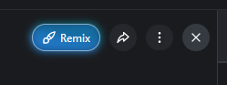

# civitai-download-helper
A combination of tapermonkey/violentmonkey/greasemonkey script for the browser and a tiny light weight python script to help in downloading resources related to an image with single click

# Installing the browser helper script
You will need tapermonkey or violentmonkey or greasemonkey or any flavour based on them.
Install the browser script by clicking on this icon:

[](https://raw.githubusercontent.com/bytenerdalpha/civitai-download-helper/main/civitai-monkey.user.js)

it will override the close button on the image pages:



Clicking on this button will trigger an API call to the backend python script (once it is run) and the script will then download the resources used in generating the image.

# Running the python script
You can download the latest release which will include a set of python script and the browser script. Or, you can 
download the source and work with it.

## To download from release: 
https://github.com/bytenerdalpha/civitai-download-helper/releases

## To download from source:
* Clone the repository
```shell
git clone https://github.com/bytenerdalpha/civitai-download-helper.git
```
* Navigate to the directory:
```shell
cd civitai-download-helper
```

* Install the dependencies required by the script like this:
```shell
python install -r requirements.txt
```

* Make a copy of env.template file to .env
```shell
cp env.template .env
```

* Open the .env file and update the values
  * TOKEN - you can get a token by generating it in civitai here: https://education.civitai.com/civitais-guide-to-downloading-via-api/#how-do-i-download-via-the-api

* Run the python script:
```shell
python civitai-fast.py
or
double click on start.bat file (windows)
```

* This will run the python server and will listen for download instructions from the browser script
